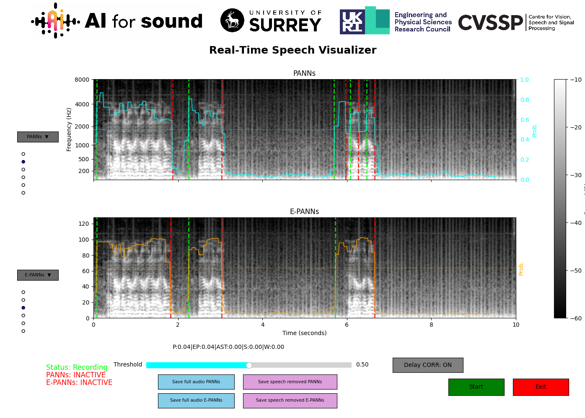

# Real-Time Speech Detection & Privacy-Preserving Audio Processing

[](https://github.com/gbibbo/vad_demo)
[](LICENSE)
[](https://python.org)
[](https://zenodo.org/records/17050321)

A real-time speech detection and removal framework for privacy-preserving audio recordings, featuring multiple state-of-the-art AI models with interactive visualization.



### Try the demo in your browser

[](https://huggingface.co/spaces/gbibbo/vad_demo)

> Alternatively, you can use the version hosted at **Hugging Face Spaces**: https://huggingface.co/spaces/gbibbo/vad_demo

## 🎯 Overview

This demonstration provides a speech removal framework designed to identify and remove personal information (speech) from domestic audio recordings while preserving other environmental sounds. Our tool addresses privacy concerns in smart home applications and public audio datasets by offering real-time speech detection with multiple AI models.

### Key Features

- **🎤 Real-time Audio Processing**: Captures audio at 32kHz with continuous 4-second chunk processing
- **🤖 Multi-Model Support**: Compare 6 different AI models side-by-side
  - **PANNs** (CNN14 with attention) - 81M parameters
  - **E-PANNs** (Efficient PANNs) - 22M parameters (73% reduction)
  - **AST** (Audio Spectrogram Transformer) - 88M parameters  
  - **Silero-VAD** (Lightweight neural VAD) - 1.8M parameters
  - **WebRTC-VAD** (Classic signal processing) - <0.1M parameters
- **📊 Live Visualization**: Dual mel-spectrogram displays with probability curves
- **⚡ Dynamic Delay Calibration**: Automatic model-specific processing delay correction
- **🔒 Privacy-Preserving Export**: Save original audio or speech-removed versions
- **🕹️ Interactive Controls**: Adjustable detection thresholds and model comparison

### Performance Benchmarks

Evaluated on CHiME-Home dataset:

| Model | F1-Score | Parameters | RTF* | Best For |
|-------|----------|------------|------|----------|
| AST | 0.860 | 88M | 0.039 | **Best accuracy + efficiency** |
| PANNs | 0.848 | 81M | 1.263 | High accuracy (CPU intensive) |
| E-PANNs | 0.847 | 22M | 0.154 | Good accuracy, efficient |
| Silero-VAD | 0.806 | 1.8M | 0.057 | **Constrained environments** |
| WebRTC-VAD | 0.708 | <0.1M | 0.002 | **Ultra-fast processing** |

*RTF: Real-Time Factor (lower is better, <1.0 = real-time capable)

## 🚀 Quick Start

### Windows Installation

1. **Clone and setup:**
```bash
git clone https://github.com/gbibbo/vad_demo.git
cd vad_demo
install_windows.bat
```

2. **Run the application:**
```bash
run_app.bat
```

## 📋 Requirements

- **System**: Windows 10/11
- **Python**: 3.8 or higher
- **Audio**: Working microphone and audio permissions
- **Memory**: 4GB RAM minimum (8GB recommended)
- **Storage**: 2GB for models and dependencies

## 🎮 Usage

1. **Start the application** by running `run_app.bat`
2. **Configure models** using dropdown menus (left side) to select models for Panel A and Panel B
3. **Begin detection** by clicking "Start" to begin real-time recording
4. **Adjust settings** using threshold slider (0-1) to control sensitivity
5. **Export results:**
   - **"Save full audio"**: Exports 10-second buffer with JSON annotations
   - **"Save speech removed"**: Exports privacy-preserved audio (speech→silence)

### Visual Interface Guide

- **Green markers**: Speech onset detection
- **Red markers**: Speech offset detection  
- **Colored curves**: Model-specific probability scores
- **Spectrograms**: Real-time mel-spectrogram visualization (128 mel bins, 20-8000 Hz)

## 🔬 Research Applications

This tool supports research in:

- **Privacy-preserving audio datasets** (GDPR compliance)
- **Smart home audio processing** 
- **Voice activity detection benchmarking**
- **Real-time audio analysis systems**
- **Domestic environment sound recognition**

### Citing This Work

```bibtex
@inproceedings{bibbo2025speech,
  title={Speech Removal Framework for Privacy-Preserving Audio Recordings},
  author={[Authors omitted for review]},
  booktitle={2025 IEEE Workshop on Applications of Signal Processing to Audio and Acoustics (WASPAA)},
  year={2025},
  organization={IEEE}
}
```

## 📄 License

This project is licensed under the MIT License - see the [LICENSE](LICENSE) file for details.

## 🙏 Acknowledgments

- **AudioSet Labels**: Provided by Google Research
- **PANNs Models**: Based on Kong et al. (2020)
- **E-PANNs**: Efficient architecture by Singh et al. (2023)
- **AST**: Audio Spectrogram Transformer by Gong et al. (2021)
- **Silero-VAD**: Enterprise-grade VAD by Silero Team
- **Funding**: AI4S, University of Surrey, EPSRC, CVSSP
